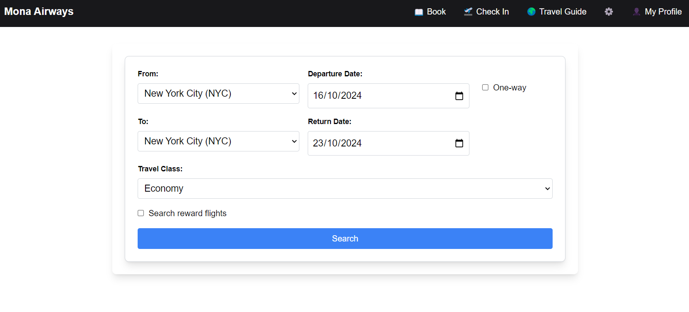
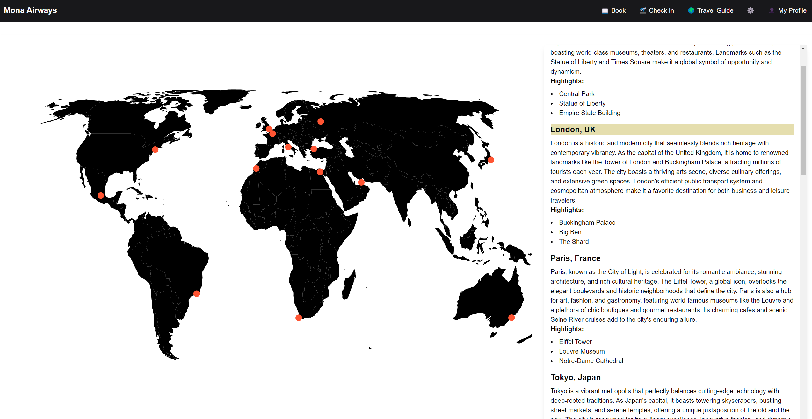
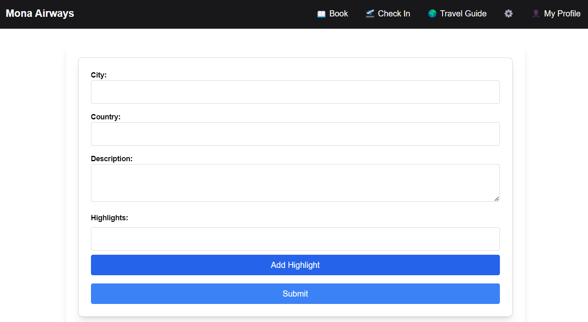
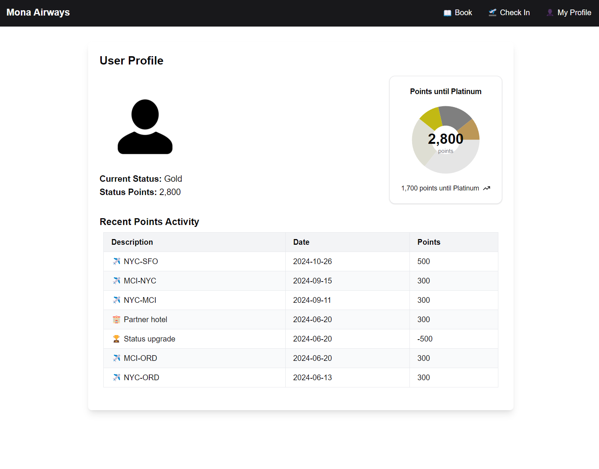

This is the website for Mona Airways. Fly with the Octocat!

## Getting Started

First, install from npm

```bash
npm install
```

Then run the development server:

```bash
npm run dev
```

Open [http://localhost:3000](http://localhost:3000) with your browser to see the result.

## Features

### Booking Page

_Note: Only the UI behaviour is implemented - no functionality required_

Users should be able to:
- Select a From location and Departure Date
- Check the "One-way" checkbox which will disable the To and Return Date fields
- If not one-way, select a To location and Return Date
- Select a Travel Class
- Check the Search reward flights option
- Click Search



## Travel Guide Page

_Note: This page should function as expected_

Users should be able to:
- See a world map with pins on each city
- See a list of locations, descriptions, and highlights on the right (optional)
- Click on a pin on the map - this should highlight the appropriate city guide and scroll to it if it's not currently visible on the page
- (Alternatively) When a pin is clicked, show the appropriate city guide




## Travel Guide Admin Page

_Note: Only the UI and lat/long lookup should work on this page. No back-end functionality required._

⚠️ _Demo Note: We'll be asking Copilot Workspace to help add an image upload to this page. We only really need to see the UI end product, but expect other (e.g. data retrieval) files will need to change._

Users should be able to:
- Type a City and Country
- When both City and Country are filled, show the latitude and longitude for that city below. If invalid, show an error.
- Add a plain text long-form description for the city
- Add a list of travel highlights for the city (tourist attractions)



### Profile Page

_Note: This page should function as expected_

⚠️ _Demo Note: We will be using Copilot in VS Code to add a line graph showing monthly points changes below the table_

Users should be able to:
- See their profile picture, current status, and status points
- See a visualisation of their progress towards the next status level
- See a table of recent points activity


